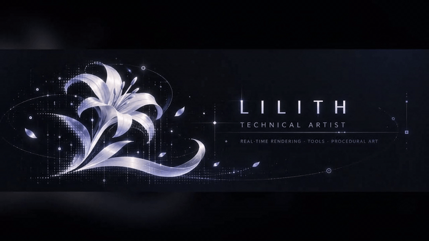

  

  <em>“Knowing a flower is made of cells does not make the flower disappear.”</em>

## About

I'm **Jianghui Liu (Lilith)**, a technical artist working across real-time engines, rendering, procedural workflows, environment art, and artist-facing tools.

I care about systems that are visually expressive, technically robust, reusable, and practical for production.

## Selected projects

<table>
  <tr>
    <td width="33%" valign="top">
      <h3>Tidemark</h3>
      UNREAL ENGINE 5 · ENVIRONMENT TA  
      Real-time environment and technical art project focused on modular production, scene construction, reusable tooling, and production-ready workflows.
    </td>
    <td width="33%" valign="top">
      <h3>SoftMatter</h3>
      UNITY · MATERIAL R&D  
      A reusable soft translucent material system using jelly as the first ground-truth study: thickness, absorption, refraction, scattering, wet highlights, and deformation.
    </td>
    <td width="33%" valign="top">
      <h3>AFTERIMAGE</h3>
      GODOT · ORIGINAL GAME  
      A near-future narrative game exploring human–machine intimacy, perception, identity, and the gap between what something is made of and what it means.
    </td>
  </tr>
</table>

## Focus

`Real-time Rendering` · `Shaders & Materials` · `Technical Art` · `Procedural Workflows` · `Tools Development` · `Pipeline Automation` · `Environment Art`

## Toolbox

`Unreal Engine 5` · `Unity` · `Godot` · `C++` · `Python` · `HLSL / Shaders` · `Blender` · `Substance Designer` · `Substance Painter`

---

Project repositories, technical breakdowns, and playable work will be linked here as they become public.
